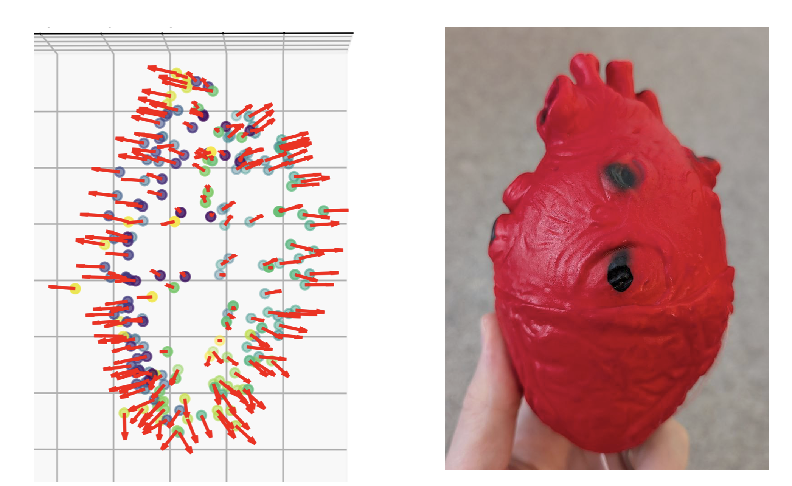
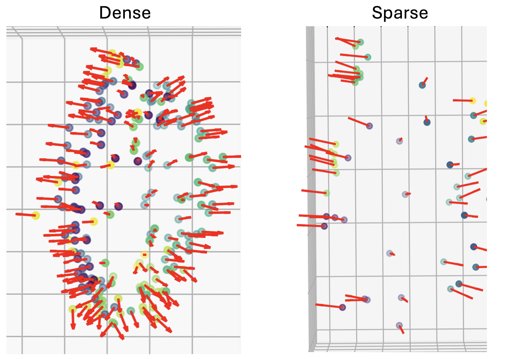

# Ultrasound Perception with Monty

This codebase is for exploring the application of [Monty](https://github.com/thousandbrainsproject/tbp.monty/) to ultrasound data. It consists of two functional components:
1. Code to train Monty on a downloadable ultrasound dataset that the Thousand Brains Project team have collected, and to evaluate its performance on held-out data. This dataset consists of common household objects, including a coffee mug and a spam can (as well as less common household objects, like a rubber heart...). These objects were scanned with an ultrasound probe while the position of the probe was simultaneously tracked, providing paired sensorimotor data.
2. Code required to collect such a dataset of ultrasound images, together with tracking data for the associated ultrasound probe. This code is provided primarily for posterity purposes, as implementing the full data-collection pipeline is non-trivial.

[Monty is a sensorimotor system](https://arxiv.org/abs/2412.18354) with [a variety of exciting capabilities](https://arxiv.org/abs/2507.04494). Medical ultrasound is an inherently sensorimotor form of clinical imaging, and [automated ultrasound would make medical diagnostics more accessible around the world](https://www.gatesfoundation.org/ideas/science-innovation-technology/future-womens-health-technology/ai-ultrasounds). If you're interested in applying Monty to real-world data, or curious about long-term medical applications of Monty, then you're in the right place!



*An example of a model learned by Monty from ultrasound data, as well as the underlying object ❤️*

The majority of this code was produced during the [TBP Robot Hackathon in May 2025](https://thousandbrains.org/2025-05-robot-hackathon/), with further refinements since then. As such, it currently relies on an old version of Monty. There are many ways in which the codebase could be further improved (see [Learn More & Contribute](#learn-more--contribute)), and we are hoping this is something that others take part in!

# Table of Contents

- [Installation](#installation)
- [Datasets & Pre-Trained Models](#datasets)
- [Benchmark Results](#benchmark-results)
- [Experiments for Training and Evaluation](#experiments-for-training-and-evaluation)
- [Learn More & Contribute](#learn-more--contribute)
- [Live Experiments and Data Collection](#live-experiments-and-data-collection)


# Installation

## Conda Environment

The environment for this project is managed with [conda](https://www.anaconda.com/download/success).

To create the environment, first clone the repository, then run:

### ARM64 (Apple Silicon) (zsh shell)
```
conda env create -f environment.yml --subdir=osx-64
conda init zsh
conda activate tbp.ultrasound_perception
conda config --env --set subdir osx-64
```

### ARM64 (Apple Silicon) (bash shell)
```
conda env create -f environment.yml --subdir=osx-64
conda init
conda activate tbp.ultrasound_perception
conda config --env --set subdir osx-64
```

### Intel (zsh shell)
```
conda env create -f environment.yml
conda init zsh
conda activate tbp.ultrasound_perception
```

### Intel (bash shell)
```
conda env create -f environment.yml
conda init
conda activate tbp.ultrasound_perception
```

# Datasets & Pre-Trained Models

A number of datasets are used in the experiments within this repository. Once unzipped, these should be placed in a `~/tbp/data/` directory if you would like to use the configurations as currently specified.

### TBP Robot Lab

The ultrasound datasets below use the objects found in the [TBP Robot Lab dataset](https://github.com/thousandbrainsproject/monty_lab/tree/65d7411edda789e39bf535040dcb4fbeb1f753d8/tbp_robot_lab). This dataset consists of 10 everyday objects that are relatively easy to purchase, and which can be submerged in fluid such as water (which is a requirement for ultrasound scanning). They were previously 3D scanned, either by ourselves during the [Monty Meets World hackathon](https://thousandbrainsproject.readme.io/docs/using-monty-for-robotics#example-1-monty-meets-world-ipad-app), or as part of the original creation of the [YCB dataset](https://www.ycbbenchmarks.com/object-models/). They are thus available as 3D meshes + textures that can be freely explored by Monty in a simulated environment. To train a Monty model on simulated data in Habitat, and thereby assess sim-to-real (i.e., sim-to-ultrasound) performance, you will need this dataset.

[Download the TBP Robot Lab dataset from AWS (.zip file)](https://tbp-data-public-5e789bd48e75350c.s3.us-east-2.amazonaws.com/tbp.monty/tbp_robot_lab.zip)

### Ultrasound Robot Lab

There are two ultrasound datasets, one with "dense" samples, and one with "sparse" samples. Both consist of ultrasound scans of the 10 Robot Lab objects, along with tracking data for the ultrasound probe that was used. The files contain a fixed sequence of observations, which will be experienced in the same order whenever an object in the dataset is loaded. Note that each object was only ever scanned in a single orientation.

The dense dataset consists of 200 individual observations for each object. During scanning, a systematic policy was used by the human operator to densely cover as much of an object's surface as possible. This should generally be viewed as a "training" dataset when Monty is learning on ultrasound data.

The sparse dataset consists of 50 individual observations for each object. During scanning, an "inference-focused" policy was used by the human operator, which involved moving relatively quickly from one part of an object to another distant part. For example, after exploring the handle of the coffee mug, the operator would move to the rim, and then to an area near the base of the mug. Due to this policy and the number of observations, the surface is not sampled nearly as densely. As such, this is best viewed as a "testing"/inference-time dataset, either for sim-to-real or real-to-real evaluations.



*Example models learned by Monty for the rubber heart when provided with either the dense or the sparse data samples.*

[Download the Dense Ultrasound Robot Lab dataset from AWS (.zip file)](https://tbp-data-public-5e789bd48e75350c.s3.us-east-2.amazonaws.com/tbp.monty/ultrasound_robot_lab_dense.zip)

[Download Sparse Ultrasound Robot Lab dataset from AWS (.zip file)](https://tbp-data-public-5e789bd48e75350c.s3.us-east-2.amazonaws.com/tbp.monty/ultrasound_robot_lab_sparse.zip)

Note that if you inspect the downloaded ultrasound folders, you will notice that their contents are very different from TBP Robot Lab, because the ultrasound datasets consist of `.json` files that store individual ultrasound images paired with position-tracking data. This is thus different from the 3D meshes that underlie many other datasets currently used by Monty (including TBP Robot Lab). This is also why the sequence of observations for the ultrasound objects is fixed, unless you choose to implement a custom dataloader that samples them in an alternative order.

### Pre-trained models

You can quickly train the Monty models from scratch by running the commands provided below under [Experiments for Training and Evaluation](#experiments-for-training-and-evaluation). Alternatively, you can download pre-trained models at the link below. 

[Download Monty systems trained on the dense and sparse ultrasound datasets, as well as the TBP Robot Lab (simulated) dataset](https://tbp-pretrained-models-public-c9c24aef2e49b897.s3.us-east-2.amazonaws.com/tbp.ultrasound_perception/ultrasound_robot_lab_v1.zip).

The folder should be placed in `~/tbp/results/pretrained_models/` if you would like to use the existing configs as they are.

# Benchmark Results

Below are results from the key experiments we are interested in - a primary aim of this repository is to investigate ways that we can improve performance on these experiments.

| Experiment                                    | Object Detection Accuracy | Monty Steps | Episode Time |
| --------------------------------------------- | ------------------------- | --------- | -------------- |
| real2real_dense_learning__sparse_inference    | 80.0%                     | 24.2      | 5.3s          |
| sim2real__sparse_inference                    | 30.0%                     | 40.8      | 10.4s         |
| sim2real__dense_inference                     | 60.0%                     | 200.0      | 48.9s         |

**Notes:**
- Values show the mean result for each experiment type, averaged across episodes.
- `real` refers to ultrasound data from the real world. `sim` refers to training or inference in a simulated environment, using 3D scanned objects.
- Object Detection Accuracy counts both "correct" and "correct_mlh" (correct most likely hypothesis) as successful detections
- Monty terminates each episode when it is sufficiently confident, and has passed the minimum number of inference steps. In sparse experiments with 50 total possible observations, `min_eval_steps=20`, a typical value we set for Monty. For dense inference, `min_eval_steps=199` to force Monty to observe all possible observations. This enables us to estimate Monty's peformance when the number of data samples is effectively unconstrained.
- Unlike for many simulated experiments in [Monty](https://github.com/thousandbrainsproject/tbp.monty/), rotation error would not be meaningful, as we don't have access to the ground-truth rotations of the scanned objects. As such, you will not see it in the above column.

TODO consider adding a sim2sim experiment as a baseline comparison

# Experiments for Training and Evaluation

## Running Experiments

Experiments are defined in the `configs` directory.

After installing the environment and downloading the relevant datasets, you can run an experiment with the following command:

```bash
python run.py -e <experiment_name>
```

For example:

To pretrain Monty on simulated versions of the TBP Robot Lab objects:
```bash
python run.py -e surf_agent_1lm_tbp_robot_lab
```

To pretrain Monty on the dense ultrasound dataset:
```bash
python run.py -e json_dataset_ultrasound_dense_learning
```

To run inference on the sparse ultrasound dataset with Monty pretrained on the simulated 3D objects:

```bash
python run.py -e json_dataset_ultrasound_infer_sim2real__sparse_inference
```

To run inference on the sparse ultrasound dataset with Monty pretrained on the dense ultrasound dataset:

```bash
python run.py -e json_dataset_ultrasound_infer_real2real_dense_learning__sparse_inference
```

Note that the existing experiment configs make use of default values provided in the `tbp_monty_pre_hydra_configs` directory (where Hydra refers to the recent shift in `tbp.monty` to [Hydra](https://hydra.cc/docs/intro/)). Cleaning up configs and updating to use Hydra throughout, without these defaults, is one of the many existing open Issues for this repository (see [Learn More & Contribute](#learn-more--contribute)).

## Analysis

After you run an experiment, you can see the results by going to `~/tbp/results/monty/projects/evidence_eval_runs/`, and looking for the folder with the same name as your experiment (e.g., `json_dataset_ultrasound_infer_real2real_dense_learning__sparse_inference`). In this folder, `eval_stats.csv` will provide a breakdown of the results.

We have also provided a Jupyter notebook in this repository (`VisualizeModels.ipynb`), which you may find helpful in visualizing and comparing learned models.

TODO move notebook and figure documentation to separate folders

# Learn More & Contribute

You can find more information on how we customized Monty for this use case in the writeup [here](./custom_classes/How_Monty_is_Customized.md).

We will be recording a video shortly with an overview of this repository and our results: TODO link to the video here.

You can see the [video presentation from the original hackathon here](https://youtu.be/-zrq0oTJudo).

There are lots of exciting ways that this repository can be improved, including changes that will have a direct impact on Monty's performance. These are all provided under the open Issues within this repository. If you have any questions, [please get in touch with the TBP team on Discourse](https://thousandbrains.discourse.group/).

Finally, you can read more on our [showcase page](https://thousandbrainsproject.readme.io/docs/project-showcase).

# Live Experiments and Data Collection

This repository is intended to be used for further refinements to how the existing dataset is processed, including Monty's learning and inference algorithms. Collecting additional ultrasound data is complex and requires, among other things, access to a Butterly iQ3 probe and the associated SDK in order to replicate our pipeline, and familiarity with how to perform ultrasound scanning. Should you be a sufficiently motivated individual or group and you are interested in this, please see some of the details below, and feel free to contact us for further details.

Broadly speaking, the full pipeline requires:
- A [Butterfly iQ3 probe](https://www.butterflynetwork.com/int/en-uk/iq3) and access to their SDK.
- An iPad loaded with the custom Butterfly app contained within this repository; this iPad will connect to the ultrasound probe and collect ultrasound images, before sending these via a server to the computer running an instance of Monty.
- A series of [Steam VR Base Stations 2.0](https://www.vive.com/uk/accessory/base-station2/), along with a Windows PC running SteamVR and the associated server script that we provide here.
- A [Vive 3.0 Tracker](https://www.vive.com/uk/accessory/tracker3/), attached to the ultrasound probe. Together with the above base stations, this will enable the essential tracking of the probe position, which Monty needs in order to know how the sensor is moving through space.
- Your real-world objects, and an appropriate container for scanning (i.e., an [ultrasound "phantom"](https://mediscientific.co.uk/product-category/anthropomorphic/ultrasound-phantoms/)), whether home-made or not; the existing dataset was based on scanning common household objects, such as a mug or mustard bottle, which were submerged in water inside a large plastic bag; this plastic bag was suspended from two camera tripods. Future datasets might focus on more organic objects and settings that better reflect the typical subjects of medical ultrasound.

Below, we provide a breakdown of the series of steps you need to take to run live, online experiments. These steps will setup both the ability to capture ultrasound images via the iPad app, as well as to track the position of the probe.

The basic commands to actually run experiments are below. These are called "probe-triggered" because Monty will step forward only when a user presses a button on the probe to collect a new image.

For an interactive, live inference experiment (e.g., to evaluate inference during a demo, or to collect data for an inference-focused dataset with only a few samples), run:
```bash
python run.py -e probe_triggered_data_collection_for_inference
```

To collect a new .json dataset with more samples (e.g. to serve as the training subset for a new dataset), run:
```bash
python run.py -e probe_triggered_data_collection_for_learning
```

However, before you run these, you will need to setup the iPad app with the ultrasound probe, as well as the Windows PC and associated Vive Tracker to capture the live position of the probe.

Instructions for the iPad app setup can be found [in the following README](./scripts/ipad_app/README.md).

Instructions for the tracker server can be found [in the following README](./scripts/htc_vive/README.md).

Once you have the above systems set up, follow the checklist below to begin an experiment:

#### First Object

To perform inference or data-collection with the first object

- Get all equipment powered on and working
  - iPad: unlock
  - Vive USB dongle: plug into Windows computer
  - Base stations: power on and position either side of the phantom setup; the exact position does not matter, but you want to maximize their ability to see the probe when it is moving
  - Tracker: power on, and ensure visible to base stations
  - Ultrasound probe: plug into iPad
- Launch SteamVR on Windows
- Check probe orientation:

Ensure the tracker is attached to the probe, and matches the following orientation (two "legs" towards front of probe):


You should also position the tracker puck such that its center, relative to the probe tip, is: ~10.5cm in the long axis and ~2.8cm in the short axis of the probe. If you position the tracker differently, you will need to measure the offset between the tracker and probe tip and adjust the ultrasound sensor relative to the agent position in the `get_state` method of `ProbeTriggeredUltrasoundEnvironment`, as well as `load_next_data_point` in `JSONDatasetUltrasoundEnvironment`.


- Start the custom Butterfly app on the iPad
- Run the tracker server on the Windows machine (`scripts/htc_vive/server.py`)
- Run the visualization script on the Mac machine (`scripts/visualize_probe/server.py`)
- Using the visualization that pops up, position the probe at the base of the phantom bag as shown below, the click the calibration button


You should see this change reflected in the visualization service. Note this visualization is only for the operator's benefit, and to enable interpreting "goal-states" sent by Monty; it does not affect the measured locations or displacements within Monty as the probe moves.

- Run the Monty experiment `python run.py -e probe_triggered_data_collection_for_learning` (or `_for_inference`, depending on how many data samples you want to collect, and what "policy" the human operator is planning on using - see `ultrasound_experiments.py` for details)
- Enter the name of the object when prompted in the terminal; this will be used for saving all collected images
- In the iPad app, click `Start Imaging`
- Collect data by moving the probe and capturing more images!

#### Next Object

To continue inference with a subsequent object

- Change the object in the bag
- Stop the Monty experiment (if it hasn't terminated on it's own already) + start it again with the above command
- Press the "Reset step counter" button in the iPad app

